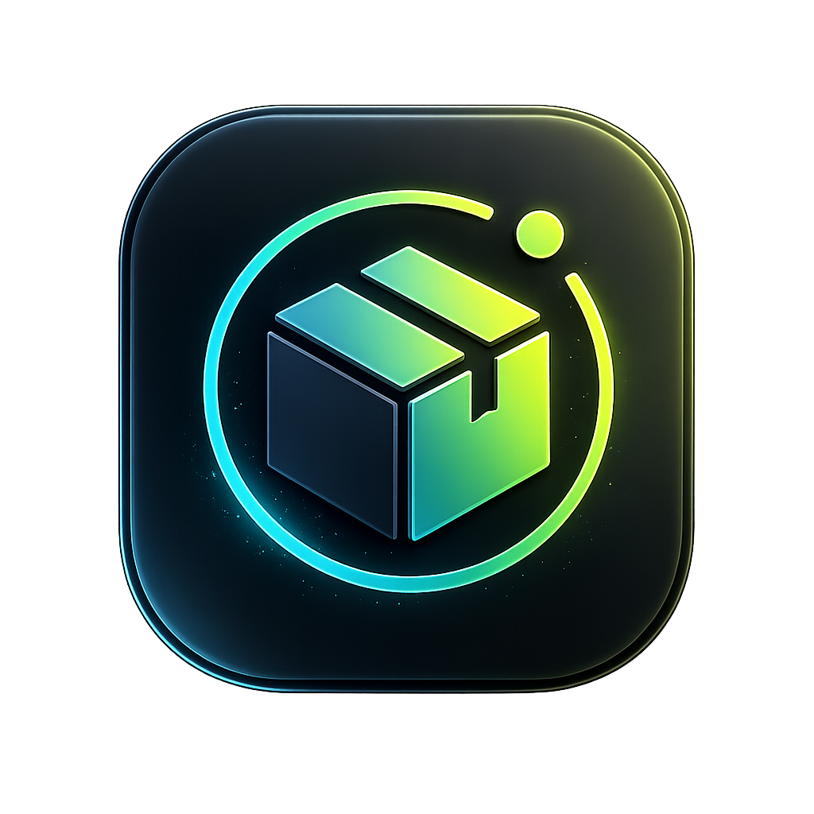

<p align="center">
  
</p>

<h1 align="center">Junkyard</h1>

<p align="center">
  <strong>A self-hosted inventory system for real-world storage.</strong>
</p>

<p align="center">
  Catalogue physical items, organize them into containers, attach photos, print QR-friendly labels and find things later without digging through every box in the house.
</p>

---

Junkyard is built for people with homelabs, workshops, storage rooms, tools, cables, spare parts, documents, hobby collections and the recurring thought: _"I know I have one somewhere."_

## What you can use it for

- Keep a searchable inventory of boxes, drawers, shelves, bags, racks, cases and other physical containers.
- Assign stable container codes such as `CT-000001` for labels, QR codes and manual lookup.
- Browse containers as a physical hierarchy: root containers, nested containers, breadcrumbs and subtree views.
- Upload many photos first, then review, rotate, assign or create items from them later.
- Track useful item metadata: category, quantity, unit, condition, retention notes, consumable stock thresholds and flags.
- Find objects by name, container code, category, notes or physical location.
- Import and export inventory data through CSV.
- Keep the full application and data under your own control.

## Why Junkyard?

Most home inventory tools are either too simple, too business-oriented or not designed for messy real storage.

Junkyard is container-first and photo-friendly. It assumes your world contains boxes inside boxes, drawers inside cabinets, shelves full of parts, loose items waiting to be classified, and photos taken quickly while you are actually sorting things.

The goal is simple: **know what you own, where it is, and how to get back to it.**

## Core concepts

### Containers, not just locations

A container can be a box, shelf, drawer, rack, bag, case, binder, temporary lot, physical zone or another support where things live.

Containers can be nested, moved and browsed as a tree, so your inventory can mirror real storage instead of forcing everything into a flat list.

### Stable public codes

Every container can use a stable public code such as:

```text
CT-000001
```

These codes are intended for labels, QR codes, manual search and long-term physical identification. Names can change; physical labels should not have to.

### Photo-first capture

Cataloguing hundreds of things manually is slow. Junkyard includes a photo inbox so you can upload images in bulk, review them later, rotate them, assign them to existing containers/items or create new item records directly from the review flow.

### Inventory as an operational view

Container pages focus on physical logistics: QR, hierarchy, child containers, photos and movement. The `/items` inventory view focuses on querying and operating on items across containers, with flat or grouped views and filters for container, location, category, consumables and orphaned items.

## Features

- Dashboard with global search, recent containers, low-stock alerts and pending-photo counters.
- Global live search for containers and items.
- Container hierarchy with root containers and nested containers.
- Breadcrumb navigation for physical paths.
- Stable CT code generation, normalization and duplicate protection.
- QR SVG generation per container.
- Printable container label area from the container detail page.
- Container types: box, subbox, shelf, drawer, rack, bag, case, binder, temporary lot, physical zone and other.
- Container move actions with cycle protection.
- Location inheritance for nested containers.
- Item catalogue with quantity, unit, category, condition, retention, notes and cover photo.
- Consumable tracking with minimum quantity and low-stock dashboard alerts.
- Orphan item workflow for objects that still need classification.
- Photo inbox for bulk capture.
- Keyboard-driven photo review flow.
- Persistent photo rotation across review, galleries, covers and listings.
- Generated photo derivatives for thumbnails and previews.
- Safe archive flows for containers, items and photos.
- CSV import with preview before confirmation.
- CSV export.
- Dockerfile, Docker Compose, healthcheck and persistent `/data` volume.

## Quick start

You only need Docker and Docker Compose.

```bash
docker compose up -d --build
```

Check that the app is running:

```bash
curl http://localhost:8088/health
```

Open:

```text
http://localhost:8088
```

The default Compose file publishes the app on host port `8088` and stores runtime data in the `inventario-data` Docker volume.

## Runtime data and persistence

Inside the container, Junkyard stores mutable state under `/data`:

- SQLite database: `/data/inventario.sqlite`
- Uploaded photos: `/data/uploads`
- Import staging files: `/data/imports`
- ASP.NET Data Protection keys: `/data/keys`

Back up the Docker volume separately from the Git repository.

## Local development

Requires the .NET 9 SDK.

```bash
dotnet restore
dotnet build
dotnet run
```

Local development uses `App_Data/` by default. Docker uses `/data`.

Useful maintenance commands exposed by the app binary:

```bash
dotnet run -- --normalize-photo-rotations
dotnet run -- --generate-photo-derivatives
```

## Data privacy

A personal inventory can expose sensitive information: possessions, storage locations and photos of private spaces.

This repository is intentionally limited to source code, schema-upgrade logic, documentation and safe static assets. Runtime data must stay out of Git.

The following are deliberately ignored by `.gitignore` and `.dockerignore`:

- `App_Data/`
- `*.sqlite`, `*.db` and journal/WAL files
- uploaded photos and `wwwroot/uploads/`
- imports, exports, backups, logs and `.env` files

If you expose Junkyard outside a trusted local network, put authentication and TLS in front of it before entering real inventory data.

## Tech stack

- ASP.NET Core Razor Pages on .NET 9
- EF Core with SQLite
- QRCoder for QR SVG generation
- ImageSharp for image handling
- Docker and Docker Compose for deployment

## Project status

Junkyard is under active development and already usable for personal inventory workflows. The model is evolving around containers, stable codes, QR labels, photo-first capture and a more operational inventory view.

Expect some changes while the product language and UX settle.

## Good first workflows

1. Create one or more physical locations.
2. Create a root container and let Junkyard generate its CT code.
3. Print or copy the container QR/label from the container page.
4. Add items directly, or upload photos into the photo inbox.
5. Review photos, rotate them if needed, and assign them to containers or items.
6. Use global search or `/items` to find things by code, name, category, note or location.

## Documentation

- [Architecture](docs/ARCHITECTURE.md)
- [Privacy and Data Handling](docs/PRIVACY.md)

## Contributing

Real-world inventory workflows are welcome: weird storage setups, label ideas, import/export needs, UI pain points, search improvements, photo workflows and deployment feedback.

Areas where contributions are especially useful:

- Docker and deployment polish
- QR and label printing
- mobile capture workflows
- import/export formats
- UI/UX refinements
- documentation
- tests and large-inventory feedback

## License

MIT. See [LICENSE](LICENSE).
