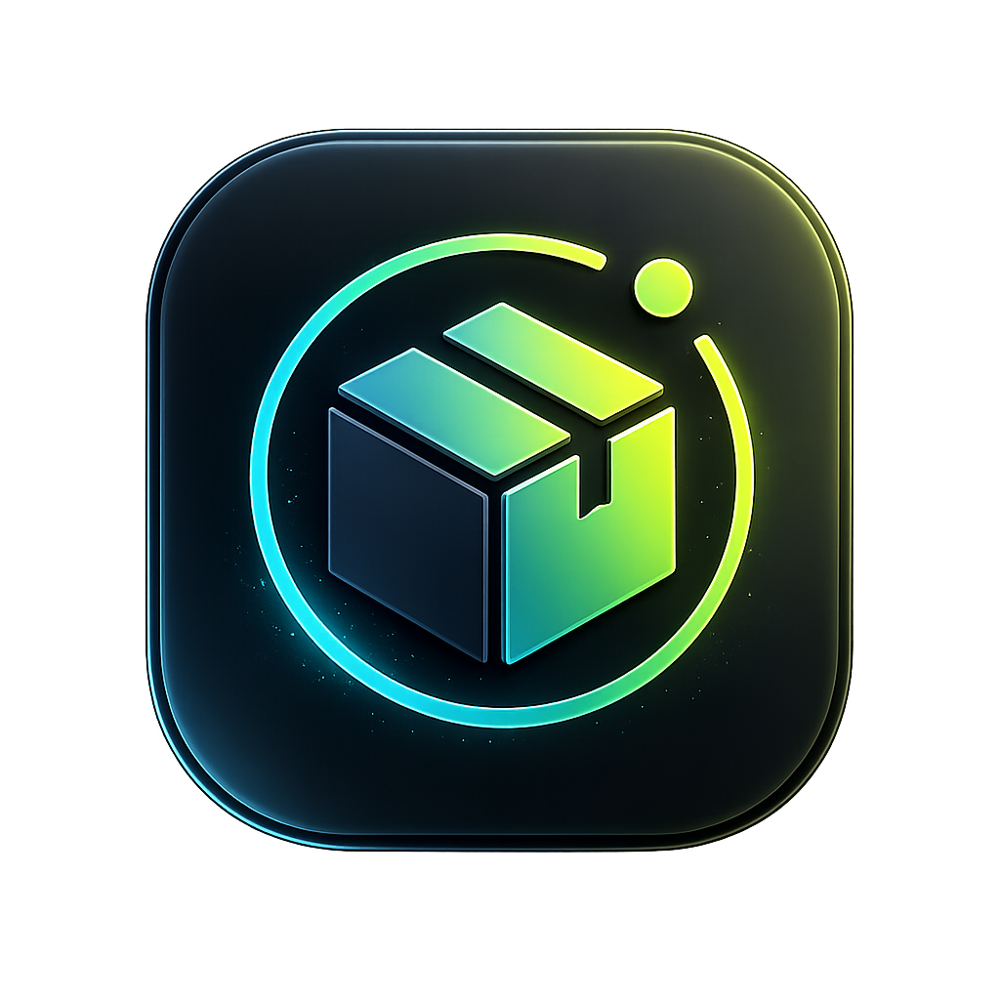

<p align="center">
  
</p>

<h1 align="center">Junkyard</h1>

<p align="center">
  <strong>Self-hosted inventory for real-world storage, photos, containers and consumable stock.</strong>
</p>

<p align="center">
  Catalogue physical items, organize them into nested containers, attach photos, classify objects, track fungible stock, print QR-friendly labels and find things later without opening every box in the house.
</p>

---

Junkyard is built for inventories that look like real life: boxes inside boxes, drawers full of cables, shelves full of parts, half-used packs of batteries, tools in several places, loose objects waiting to be classified, and photos taken while sorting instead of after everything is perfect.

It is aimed at homelabs, workshops, storage rooms, electronics benches, tool collections, hobby inventories, spare parts, documents, collections and anyone who has ever thought:

> "I know I have one somewhere."

The goal is simple: **know what you own, where it is, what state it is in, and how to get back to it.**

---

## Highlights

- **Container-first inventory**  
  Model real storage as containers: boxes, shelves, drawers, racks, bags, binders, cases, physical zones and nested containers.

- **Stable public codes**  
  Containers and items can use stable public codes such as `CT-000-001` and `IT-000-001` for labels, QR codes and manual lookup.

- **Photo-first capture**  
  Upload photos in bulk, review them later, rotate them, assign them to existing records or create new items directly from the photo review flow.

- **Angular SPA interface**  
  The current main interface is an Angular SPA backed by an ASP.NET Core API, with a darker, denser and more operational UI for inventory work.

- **Consumables and fungible stock**  
  Group equivalent consumable items by class and subtype, so several physical items can contribute to a single stock line.

- **Classes and subtypes**  
  Use item classes to describe behavior and specialized inventory modes: individual objects, fungibles, kits and lots.

- **Maintenance and cleanup tools**  
  Diagnose classification debt such as temporary tags, untyped consumables or legacy markers.

- **Self-hosted and private**  
  Keep the application, database, uploads and operational data under your own control.

---

## What Junkyard is for

Junkyard is designed for personal and small-lab inventory workflows where physical context matters.

Use it to track:

- boxes, drawers, shelves, racks, bags, cases and binders;
- tools, cables, adapters, power supplies and spare parts;
- electronics, boards, sensors, radio hardware and lab material;
- batteries, screws, connectors and other consumables;
- computer hardware, disks, tapes, machines and accessories;
- collectibles, documents, archived material and odd objects;
- items that are still unclassified or temporarily quarantined.

It is not a generic warehouse ERP. It is intentionally biased toward messy, physical, photo-heavy, self-hosted inventory.

---

## Core concepts

### Containers

A container is any physical place or support where objects live.

Examples:

- box;
- sub-box;
- shelf;
- drawer;
- rack;
- bag;
- case;
- binder;
- temporary lot;
- physical zone.

Containers can be nested, moved and browsed as a tree. This lets the inventory mirror real storage instead of forcing everything into a flat list.

Example:

```text
Room
└── Shelf
    └── Box CT-000-123
        └── Small parts organizer
            └── Connectors
```

### Items

Items are the physical things being tracked.

An item can have:

- stable public code;
- name and description;
- quantity and unit;
- category;
- tags;
- class and subtype;
- container;
- photos;
- quarantine flag;
- consumable behavior;
- retention and condition metadata where applicable.

Items may live inside containers or remain unboxed/unclassified until they are processed.

### Stable public codes

Junkyard separates internal database IDs from public, human-facing codes.

Container code:

```text
CT-000-001
```

Item code:

```text
IT-000-001
```

These codes are intended for:

- printed labels;
- QR codes;
- manual search;
- long-term identification;
- physical workflows where names may change but labels should remain stable.

Names can change. Printed labels and QR targets should not have to.

### Photos

Photos are a first-class part of the workflow.

Junkyard supports:

- bulk upload;
- photo inbox/review flow;
- rotation;
- assignment to items or containers;
- cover photos;
- thumbnails and previews;
- gallery-oriented inventory views.

This is useful when cataloguing many objects quickly: take photos first, classify later.

### Tags

Tags are transversal attributes.

Examples:

- `RF`;
- `Spare part`;
- `Development`;
- `Safety`;
- `Accessory`.

Tags are not meant to replace item classes, states or stock grouping. They are useful for flexible cross-cutting labels.

### Classes, subtypes and inventory modes

Junkyard supports item classification through classes and subtypes.

An `ItemClass` defines the broad behavior or specialized nature of an item.

An `InventoryMode` defines how the item is counted:

- `Individual`: a concrete object tracked one by one;
- `Fungible`: stock that can be aggregated by subtype;
- `Kit`: a functional set kept as a unit;
- `Lot`: a grouped lot of related objects.

An `ItemSubtype` defines a variant inside a class.

For fungible classes, the subtype acts as the stock grouping key.

Example:

```text
Class: Battery
Inventory mode: Fungible
Subtype: AAA
Quantity: 15
```

Several physical items can contribute to the same stock line:

```text
AAA batteries, brand A   10 pcs
AAA batteries, brand B    5 pcs
-----------------------------
Battery / AAA            15 pcs
```

For individual classes, subtypes can still help classify objects without aggregating stock:

```text
Class: Computer
Inventory mode: Individual
Subtype: Mini PC
```

### Consumables

Consumables are handled as fungible inventory when appropriate.

Instead of only listing every physical pack separately, Junkyard can aggregate compatible consumables by class and subtype.

This is useful for things like:

- batteries;
- screws;
- connectors;
- cable ties;
- filament;
- gloves;
- tapes;
- small hardware;
- workshop supplies.

A physical item still exists and remains traceable: it keeps its item code, photos, container and metadata. The consumables view adds an operational stock layer above those physical records.

### Quarantine

Quarantine is a dedicated boolean flag, not a tag, class or subtype.

Use it for items that need review, isolation, special handling or later decision-making without polluting the tag model.

---

## Main workflows

### 1. Create physical structure

Create locations and containers that match real storage.

Examples:

```text
Office
Workshop
Storage room
Electronics shelf
Cable drawer
```

Then create containers inside them and let Junkyard generate stable CT codes.

### 2. Label containers

Use the container page to access QR-friendly information and printable label areas.

A typical label can contain:

- container name;
- `CT-000-001` code;
- QR target;
- optional location/context.

### 3. Capture photos in bulk

Upload photos into the photo inbox while sorting.

You can review them later, rotate them, assign them to containers/items or create item records directly from the review screen.

### 4. Create and classify items

Items can be created directly or from the photo review flow.

Add:

- name;
- description;
- quantity/unit;
- container;
- category;
- tags;
- class/subtype;
- quarantine flag when needed.

### 5. Track consumables

Assign fungible classes and subtypes to consumable items.

Junkyard can then aggregate stock by class/subtype and show the physical items behind each stock line.

### 6. Find things later

Search and browse by:

- item name;
- item code;
- container code;
- tags;
- category;
- class/subtype;
- physical hierarchy;
- location;
- notes/description.

### 7. Diagnose incomplete classification

Use maintenance and diagnostic screens to find:

- temporary tags still waiting for migration;
- consumables without class/subtype;
- legacy markers;
- unclassified or untagged items.

---

## Feature overview

### Dashboard

- Operational summary.
- Global search.
- Recent containers.
- Low-stock indicators.
- Pending photo counters.
- Quick navigation to common workflows.

### Inventory

- SPA inventory view.
- Flat, grouped, gallery and table-oriented browsing modes.
- Filters for tags, categories, containers, classes, quarantine and unclassified records.
- Item cards with photo-first layout.
- Stable IT codes.
- Item detail pages with photos, metadata and classification chips.

### Containers

- Root and nested containers.
- Physical hierarchy.
- Breadcrumb navigation.
- Stable CT code generation.
- CT code normalization and duplicate protection.
- Container types.
- Container photos.
- Child containers.
- Items inside containers.
- Move actions with cycle protection.
- Location inheritance for nested containers.
- QR-friendly container detail.

### Photos

- Bulk photo inbox.
- Keyboard-oriented review flow.
- Rotation support.
- Assignment to existing items or containers.
- Create items from pending photos.
- Generated derivatives for thumbnails and previews.
- Cover-photo behavior for listings and cards.

### Consumables

- Fungible inventory mode.
- Stock aggregation by class/subtype.
- Unit display.
- Minimum and target stock values on subtypes.
- Simple stock status.
- Physical item breakdown behind aggregated stock.
- Fallback section for consumables that still need classification.

### Classification

- Item classes.
- Inventory modes: individual, fungible, kit and lot.
- Subtypes per class.
- Class/subtype management UI.
- Active/inactive handling instead of destructive deletion.
- Classification diagnostics.
- Support for migration away from temporary tags.

### Tags and categories

- Tags for flexible cross-cutting attributes.
- Tag management with colors and usage counters.
- Categories for inherited/classic classification and navigation.
- Filters for untagged items.
- Clear separation between tags, classes, subtypes and quarantine.

### Maintenance

- Maintenance area for low-frequency operational tools.
- Classification diagnostics.
- Cleanup reports for temporary tags and legacy classification debt.
- Space for future administrative tools.

### Import and export

- CSV import.
- Import preview before confirmation.
- CSV export.
- Runtime data kept outside the repository.

### Deployment

- Dockerfile.
- Docker Compose.
- Healthcheck.
- Persistent `/data` volume.
- SQLite runtime database.
- Uploaded photos stored on persistent volume.

---

## Architecture at a glance

Junkyard currently uses an Angular SPA as the main application interface, backed by an ASP.NET Core backend.

High-level stack:

- Angular SPA frontend.
- ASP.NET Core backend/API on .NET 9.
- EF Core with SQLite.
- SQLite schema-upgrade logic for deployed instances.
- Image handling for uploads, rotation and derivatives.
- QR generation for container labels.
- Docker and Docker Compose for deployment.
- Persistent runtime data under `/data`.

The older Razor/classic backend remains part of the codebase during the transition, but new product work is focused on the SPA experience.

---

## Quick start

You need Docker and Docker Compose.

```bash
docker compose up -d --build
```

The default Compose file starts the ASP.NET Core backend container and publishes it on host port `8089`.

Check that the backend is running:

```bash
curl http://localhost:8089/health
```

Open the backend/classic application endpoint:

```text
http://localhost:8089
```

For SPA development, run the Angular dev server from the SPA workspace used by the repository and browse to the configured SPA port. In the current development setup this is commonly:

```text
http://localhost:8088
```

The SPA talks to the ASP.NET Core backend/API.

---

## Runtime data and persistence

Inside the container, Junkyard stores mutable runtime state under `/data`.

Typical runtime data includes:

- SQLite database: `/data/inventario.sqlite`
- uploaded photos: `/data/uploads`
- import staging files: `/data/imports`
- ASP.NET Data Protection keys: `/data/keys`

Back up the Docker volume separately from the Git repository.

A source-code backup is not an inventory backup. The database and uploaded photos are the critical runtime data.

---

## Local development

Backend requirements:

- .NET 9 SDK.

Common backend commands:

```bash
dotnet restore
dotnet build
dotnet run
```

Frontend requirements depend on the Angular workspace inside the repository.

Typical frontend flow from that workspace:

```bash
npm install
npm run build
```

Useful maintenance commands exposed by the app binary:

```bash
dotnet run -- --normalize-photo-rotations
dotnet run -- --generate-photo-derivatives
```

Local development uses `App_Data/` by default. Docker uses `/data`.

---

## Data privacy

A personal inventory can expose sensitive information:

- possessions;
- storage locations;
- photos of private spaces;
- labels and QR codes;
- equipment ownership;
- household or workshop organization.

This repository is intentionally limited to source code, schema-upgrade logic, documentation and safe static assets. Runtime data must stay out of Git.

The following are deliberately ignored by `.gitignore` and `.dockerignore`:

- `App_Data/`
- `*.sqlite`, `*.db` and journal/WAL files
- uploaded photos and `wwwroot/uploads/`
- imports, exports, backups, logs and `.env` files

If you expose Junkyard outside a trusted local network, put authentication and TLS in front of it before entering real inventory data.

---

## Documentation

Available documentation:

- [Architecture](docs/ARCHITECTURE.md)
- [Item classification](docs/ITEM-CLASSIFICATION.md)
- [AI item suggestions](docs/AI-ITEM-SUGGESTIONS.md)
- [Privacy and Data Handling](docs/PRIVACY.md)

The documentation is evolving alongside the SPA and data model. Some older notes may still refer to the classic Razor interface where the SPA has already become the primary workflow.

---

## Project status

Junkyard is under active development and already usable for personal inventory workflows.

Current product direction:

- Angular SPA as the main interface.
- ASP.NET Core backend/API.
- Container-first physical inventory.
- Stable CT and IT public codes.
- Photo-first capture and review.
- Class/subtype model for richer item behavior.
- Fungible stock aggregation for consumables.
- Maintenance tools for classification cleanup.

Expect changes while the product language, UX and data model continue to settle.

---

## Possible future directions

The following areas are planned or being explored, without a fixed timeline:

- bulk/wizard flows for assigning classes, subtypes and tags;
- class-specific fields for machines, disks, tapes, batteries and other specialized item types;
- item event timelines for maintenance, repairs, upgrades, movements and lifecycle history;
- richer stock movements for consumables;
- better QR/label printing workflows;
- mobile-first photo capture;
- improved import/export formats;
- richer diagnostics and maintenance tools;
- expanded documentation/wiki pages;
- stronger test coverage around large inventories.

The guiding principle is to keep Junkyard useful for real physical inventory instead of turning it into a generic ERP or a full Notion clone.

---

## Contributing

Real-world inventory workflows are welcome: weird storage setups, label ideas, import/export needs, UI pain points, search improvements, photo workflows and deployment feedback.

Areas where contributions are especially useful:

- Docker and deployment polish;
- QR and label printing;
- mobile capture workflows;
- import/export formats;
- UI/UX refinements;
- documentation;
- tests and large-inventory feedback;
- examples of real storage models.

---

## License

Junkyard is licensed under the GNU Affero General Public License v3.0 or later.

SPDX-License-Identifier: `AGPL-3.0-or-later`

See [LICENSE](LICENSE).
